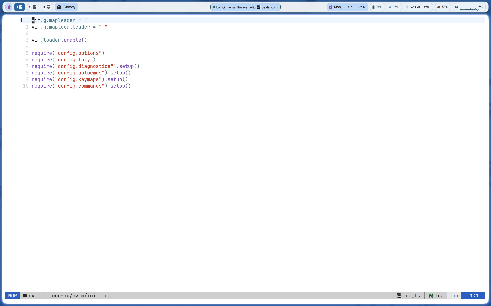
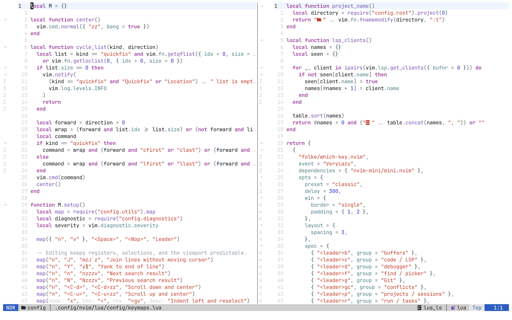
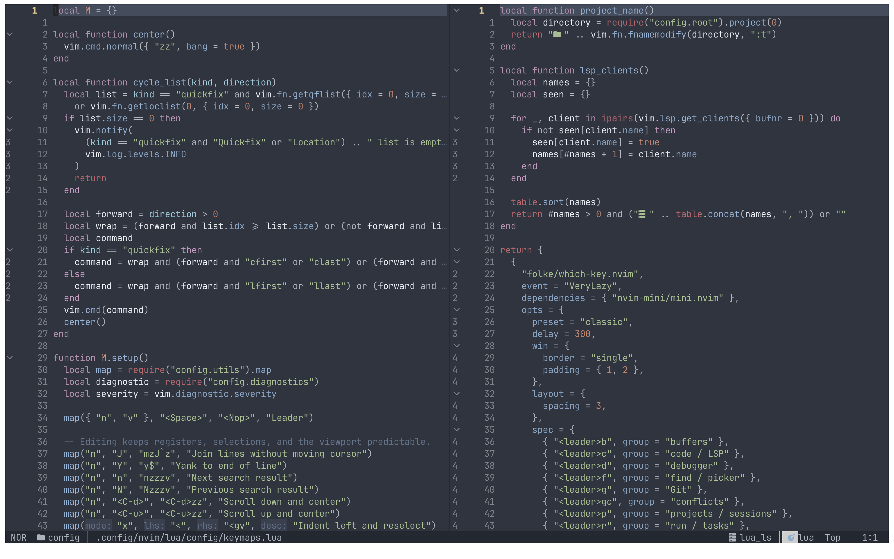

# macOS rice

My keyboard-first macOS setup: Yabai BSP tiling, skhd hotkeys, a floating
SketchyBar, JankyBorders, Ghostty, and a modular Neovim IDE. The entire desktop
switches between Nordfox dark and Xcode Light with one shortcut.

> Tested on Apple Silicon with macOS Tahoe 26.5/26.6, Yabai 7.1, SketchyBar 2.24,
> skhd 0.3.9, JankyBorders 1.9, Ghostty 1.3, and Neovim 0.12. The scripts use
> `/opt/homebrew`, so Intel Mac users should replace it with `/usr/local`.



| Xcode Light | Nordfox dark |
| --- | --- |
|  |  |

## What is included

| Component | Purpose | Main config |
| --- | --- | --- |
| [Yabai](https://github.com/asmvik/yabai) | BSP tiling, Spaces, displays, stacking | `.config/yabai/yabairc` |
| [skhd](https://github.com/asmvik/skhd) | Global keyboard shortcuts | `.config/skhd/skhdrc` |
| [SketchyBar](https://github.com/FelixKratz/SketchyBar) | Spaces, app, media, CPU, RAM, network, audio, battery, clock | `.config/sketchybar/sketchybarrc` |
| [JankyBorders](https://github.com/FelixKratz/JankyBorders) | Crisp rounded focused-window border | `.config/borders/bordersrc` |
| [Ghostty](https://github.com/ghostty-org/ghostty) | Fast terminal with synchronized themes | `.config/ghostty/config.ghostty` |
| [Neovim](https://neovim.io/) | LSP, completion, formatting, linting, tests, DAP, Git, tasks, sessions | `.config/nvim/` |

The SketchyBar is intentionally useful, not decorative:

- semantic numbered Spaces that keep their number when moved between displays;
- vector application icons, a compact desktop icon for empty Spaces, and a
  stack-size indicator;
- native hover feedback in both themes, without shell processes or layout jumps;
- atomic desktop-strip updates using stable native IDs, so deleting a middle
  desktop does not briefly scramble its number and app icons;
- a clickable Apple control center with system, display, network, VPN, battery,
  and volume details;
- currently playing media with click-to-play/pause;
- CPU graph, memory, live network throughput, volume, battery, and clock;
- event-driven updates where possible, with lightweight polling only for live
  telemetry.

## Install

Read the scripts before running them. These are personal dotfiles and the setup
changes window-management behavior across macOS.

### 1. Install Homebrew and packages

Install [Homebrew](https://brew.sh/), then:

```sh
git clone https://github.com/deniserdogan/dotfiles.git ~/dotfiles
cd ~/dotfiles
brew bundle
```

The Brewfile installs the desktop tools, Ghostty, Neovim, `jq`,
`nowplaying-cli`, common picker tools, and JetBrainsMono Nerd Font. Neovim
installs its language-specific editor tooling through Mason on first launch.

SketchyBar uses the bundled **Rice App Icons** font, derived from
[sketchybar-app-font](https://github.com/kvndrsslr/sketchybar-app-font) with an
additional Incy outline. Install it, then log out and back in if macOS does not
notice the font immediately:

```sh
mkdir -p ~/Library/Fonts
cp .config/sketchybar/fonts/rice-app-icons.ttf ~/Library/Fonts/
```

The bar and Space shortcuts require two small native helpers. Install Apple's
Command Line Tools if needed (`xcode-select --install`), then build them in the
checkout before starting services:

```sh
sh .config/sketchybar/helpers/build.sh
python3 .config/sketchybar/helpers/tests/space_controller_test.py
```

The tests use fixtures and never create, delete, or move real desktops. Helper
binaries are built locally and ignored by Git. See the
[native helper notes](.config/sketchybar/helpers/README.md) and
[font notes](.config/sketchybar/fonts/README.md) for implementation and rebuilding.

### 2. Configure macOS

In **System Settings → Desktop & Dock**:

- enable **Displays have separate Spaces**;
- disable **Automatically rearrange Spaces based on most recent use**;
- enable **Show Items On Desktop**;
- set **Click wallpaper to reveal Desktop** to **Only in Stage Manager**.

In **System Settings → Control Center**, set **Automatically hide and show the
menu bar** to **Always**. SketchyBar replaces it.

On first launch, allow both Yabai and skhd under **Privacy & Security →
Accessibility**. Restart each service after granting access.

### 3. Link the configs

Back up any existing configuration first:

```sh
mkdir -p ~/.config
stamp="$(date +%Y%m%d-%H%M%S)"

for name in borders ghostty nvim sketchybar skhd yabai; do
  if [ -e "$HOME/.config/$name" ] || [ -L "$HOME/.config/$name" ]; then
    mv "$HOME/.config/$name" "$HOME/.config/$name.backup-$stamp"
  fi
  ln -s "$HOME/dotfiles/.config/$name" "$HOME/.config/$name"
done

chmod +x ~/.config/borders/bordersrc
chmod +x ~/.config/yabai/yabairc ~/.config/yabai/scripts/*.sh
chmod +x ~/.config/sketchybar/sketchybarrc ~/.config/sketchybar/plugins/*.sh
chmod +x ~/.config/skhd/scripts/*.sh
```

If you cloned somewhere other than `~/dotfiles`, change the symlink source.
Using whole-directory symlinks keeps edits in the repository automatically.

### 4. Decide whether to enable Yabai's scripting addition

Basic window tiling works with normal Accessibility permission. This rice also
uses advanced Space operations—create, destroy, focus, and move Spaces—which
require Yabai's scripting addition and therefore a partial reduction of System
Integrity Protection.

This is a real security tradeoff. Read Yabai's current
[SIP instructions](https://github.com/asmvik/yabai/wiki/Disabling-System-Integrity-Protection)
and
[scripting-addition setup](https://github.com/asmvik/yabai/wiki/Installing-yabai-%28latest-release%29#configure-scripting-addition)
before deciding.

After following the official SIP instructions, generate a sudoers rule tied to
your username, Yabai path, and the exact hash of the installed binary:

```sh
echo "$(whoami) ALL=(root) NOPASSWD: sha256:$(shasum -a 256 "$(which yabai)" | cut -d ' ' -f 1) $(which yabai) --load-sa" \
  | sudo tee /private/etc/sudoers.d/yabai
```

Regenerate that rule every time Yabai is upgraded. The repository deliberately
does not ship a `yabai.sudoers` file because another user's username, binary
path, and hash would be wrong.

For the historical macOS 26.6 compatibility workaround, see
[the native scripting-addition note](.config/yabai/native-fix/README.md).
The loader hook falls back to the Homebrew binary when no side-by-side loader
is installed. Machine-specific installers and patched binaries are not shipped.

### 5. Start everything

```sh
yabai --start-service
skhd --start-service
brew services start sketchybar
```

JankyBorders starts from `yabairc`, so do not also start it as a separate
service. Open Ghostty and then Neovim:

```sh
nvim
```

On the first Neovim launch, lazy.nvim installs plugins and Mason installs the
configured editor tools. Let both finish, restart Neovim, then run:

```vim
:checkhealth
:ConfigHealth
```

## Yabai and macOS shortcuts

`Alt` means the left Option key (`lalt`). Directions follow Vim:
`H` left, `J` down, `K` up, `L` right.

### Focus, move, and resize windows

| Shortcut | Action |
| --- | --- |
| `Alt H/J/K/L` | Focus the window left/down/up/right |
| `Shift Alt H/J/K/L` | Warp the focused window left/down/up/right in the BSP tree |
| `Ctrl Alt H/J/K/L` | Resize the focused edge by 40 px |
| `Alt F` | Toggle native-looking zoom fullscreen |
| `Alt Space` | Toggle floating |
| `Alt S` | Toggle the next split orientation |
| `Alt + left mouse drag` | Move a window |
| `Alt + right mouse drag` | Resize a window |

Directional focus is smarter than a plain Yabai command: it handles zoomed
windows, stacks, and wraparound candidates without leaving the keyboard.

### Stacks and layout

| Shortcut | Action |
| --- | --- |
| `Shift Alt S` | Add the focused window to a stack, or pull it back into BSP |
| `Alt [` | Focus the previous member of the current stack, wrapping around |
| `Alt ]` | Focus the next member of the current stack, wrapping around |
| `Alt R` | Rotate the current BSP tree 90° |
| `Alt B` | Balance the current BSP tree |
| `Shift Alt X` | Mirror the current layout on the x-axis |
| `Shift Alt Y` | Mirror the current layout on the y-axis |

### Displays

| Shortcut | Action |
| --- | --- |
| `Cmd Alt H/J/K/L` | Focus the display left/down/up/right |
| `Cmd Alt M` | Cycle focus through connected displays |
| `Shift Cmd Alt H/J/K/L` | Move the current Space to the display in that direction |
| `Shift Cmd Alt B` | Move the current Space to the built-in display |
| `Shift Alt M` | Cycle the current Space through every display |

The entire Space moves, not just one window. Its semantic number follows it, and
SketchyBar rebuilds the Space pills after topology changes.

### Semantic Spaces

| Shortcut | Action |
| --- | --- |
| `Cmd 1` … `Cmd 9` | Focus Space 1 … 9; create missing desktops up to that number |
| `Shift Cmd 1` … `Shift Cmd 9` | Move the focused window to Space 1 … 9, creating missing desktops |
| `Shift Alt N` | Create a Space on the focused display |
| `Shift Alt Backspace` | Destroy the focused Space |

The first run creates `.config/yabai/space_roles.tsv`. It maps stable Space
identities to `slot.N` labels and is intentionally ignored by Git because it is
machine state. When a Space moves to another display, `Cmd N` still follows the
role instead of its temporary Mission Control index.

With four desktops, `Cmd 7` creates 5, 6 and 7 on the focused display and focuses
7 once the native burst is complete. Press the current desktop's shortcut again
to return to the previous desktop. Deletion switches directly to a neighboring
desktop on the same display. The last desktop on a display is protected.

Creation is explicit: event callbacks and stale bar clicks never create
desktops. One non-blocking lock prevents overlapping operations from queuing
and unexpectedly running later; the active operation commits the final strip.

### Reload and theme

| Shortcut | Action |
| --- | --- |
| `Ctrl Alt Cmd R` | Restart Yabai |
| `Ctrl Alt Cmd S` | Reload SketchyBar |
| `Ctrl Alt Cmd T` | Toggle macOS, Ghostty, Neovim, and SketchyBar light/dark themes |

The theme switch is serialized and debounced, so repeated key presses settle on
one final theme without leaving the bar and Neovim out of sync.

## SketchyBar mouse actions

| Item | Click behavior |
| --- | --- |
| Apple logo | Toggle the custom control-center popup |
| Space number | Focus that semantic Space |
| Media island | Play/pause current media |
| CPU or memory | Open Activity Monitor |
| Volume | Toggle mute |
| Volume slider | Set output volume |
| Clock | Open Calendar |
| Control-center rows | Open their matching system panel or application where configured |

## Neovim shortcuts

`<leader>` and `<localleader>` are both `Space`. Press `<leader>?` for
buffer-local mappings or pause after `Space` to let which-key show the available
groups.

The hierarchy is: `b` buffers, `c` code/LSP, `d` debugger, `f` find, `g` Git,
`p` projects/sessions, `r` tasks, `s` search/symbols, `t` tests/toggles, `u`
UI, `v` windows, and `x` diagnostics/Trouble.

### Editing and navigation

| Mapping | Modes | Action |
| --- | --- | --- |
| `J` | normal | Join lines without moving the cursor |
| `Y` | normal | Yank to end of line |
| `n` / `N` | normal | Next/previous search result, open folds, center |
| `<C-d>` / `<C-u>` | normal | Half-page down/up and center |
| `<` / `>` | visual | Indent and keep the selection |
| `J` / `K` | visual | Move selected lines down/up |
| `p` | visual | Paste without replacing the unnamed register |
| `,` / `.` / `;` | insert | Insert punctuation with an undo breakpoint |
| `q` | selected utility buffers | Close the utility window |

### Files, projects, buffers, windows, and terminals

| Mapping | Action |
| --- | --- |
| `<leader>w` / `<leader>W` | Save current file / all files |
| `<leader>q` / `<leader>Q` | Quit current window / save all and quit Neovim |
| `<leader><space>` | Smart project file picker |
| `<leader>ff` / `<leader>fg` | Find files / live grep in the project root |
| `<leader>fb` / `<leader>bl` | Buffer picker |
| `<leader>fr` / `<leader>fp` | Recent files / projects |
| `<leader>fc` / `<leader>fh` | Command history / help tags |
| `<leader>e` | Project-root explorer |
| `<leader>bd` / `<leader>bo` | Delete current / all other buffers without destroying layouts |
| `<leader>bn` / `<leader>bp` | Next / previous buffer |
| `<C-h/j/k/l>` | Move across splits in normal and terminal modes |
| `<Esc><Esc>` | Leave terminal mode |
| `<leader>v=` | Equalize splits |
| `<leader>v+` / `<leader>v-` | Increase / decrease height by four |
| `<leader>v>` / `<leader>v<` | Increase / decrease width by four |
| `<leader>vr` | Rotate windows |
| `<leader>vH/J/K/L` | Move the window to the far left/bottom/top/right |
| `<leader>ut` / `<leader>uT` | Toggle project float / open project bottom terminal |

### LSP, code, formatting, and linting

These mappings appear for buffers with an attached LSP server.

| Mapping | Action |
| --- | --- |
| `gd` / `gD` | Definition / declaration |
| `gri` / `grr` / `grt` | Implementation / references / type definition |
| `K` / `gK` | Hover / signature help |
| `<leader>ca` | Code action in normal or visual mode |
| `<leader>cA` | All source actions |
| `<leader>cO` / `<leader>cF` / `<leader>cU` | Organize imports / fix all / remove unused imports |
| `<leader>cr` | Rename symbol |
| `<leader>cs` / `<leader>cS` | Document / workspace symbols |
| `<leader>ci` / `<leader>co` | Incoming / outgoing calls |
| `<leader>ck` | Signature help |
| `<leader>cwa` / `<leader>cwr` / `<leader>cwl` | Add / remove / list workspace folders |
| `<leader>cI` / `<leader>cR` | Inspect / restart LSP clients |
| `<leader>cm` | Open Mason |
| `<leader>cf` | Asynchronous format in normal or visual mode |
| `<leader>cl` | Run the selected linter |
| `<leader>cE` | Fix the current file with project ESLint |
| `<leader>th` / `<leader>ts` | Toggle buffer inlay hints / semantic tokens |
| `<leader>cn` / `<leader>cN` | Swap with next / previous argument |

### Diagnostics, lists, and Trouble

| Mapping | Action |
| --- | --- |
| `]d` / `[d` | Next / previous diagnostic |
| `]e` / `[e` | Next / previous error |
| `]w` / `[w` | Next / previous warning |
| `<leader>cd` | Diagnostic under the cursor |
| `<leader>cD` | Current-buffer diagnostics in the location list |
| `<leader>td` | Toggle diagnostics globally |
| `<leader>tv` | Toggle current-line inline diagnostic text |
| `<leader>uD` | Toggle diagnostic signs |
| `]q` / `[q` | Next / previous quickfix item, wrapping |
| `]l` / `[l` | Next / previous location-list item, wrapping |
| `<leader>xx` / `<leader>xX` | Workspace / current-buffer diagnostics in Trouble |
| `<leader>xq` / `<leader>xl` | Quickfix / location list in Trouble |
| `<leader>xs` / `<leader>xr` | Document symbols / LSP references in Trouble |

### Git

| Mapping | Action |
| --- | --- |
| `]h` / `[h` | Next / previous hunk |
| `<leader>gs` | Stage/unstage hunk; stage selection in visual mode |
| `<leader>gr` | Reset hunk; reset selection in visual mode |
| `<leader>gS` / `<leader>gp` | Stage buffer / preview hunk |
| `<leader>gb` / `<leader>gB` | Full line blame / toggle current-line blame |
| `<leader>gd` / `<leader>gq` | Diff current file / repository hunks in quickfix |
| `ih` | Select hunk in operator-pending or visual mode |
| `<leader>gD` / `<leader>gC` | Open / close Diffview |
| `<leader>gh` / `<leader>gH` | File / repository history |
| `<leader>gg` | Lazygit at the Git or project root |
| `]x` / `[x` | Next / previous conflict in Diffview |
| `<leader>gco/gct/gcb/gca/gcn` | Choose ours/theirs/base/all/none for a conflict |

### Testing

| Mapping | Action |
| --- | --- |
| `<leader>tn` | Run nearest test |
| `<leader>tf` / `<leader>tp` | Run current file / package or directory |
| `<leader>ta` | Run all project tests |
| `<leader>tl` | Run last test |
| `<leader>tD` | Debug nearest test through DAP |
| `<leader>to` / `<leader>tO` | Open last output / toggle output panel |
| `<leader>tu` | Toggle test summary |
| `<leader>tS` | Stop test interactively |
| `]T` / `[T` | Next / previous failed test and center |

### Debugging

| Mapping | Action |
| --- | --- |
| `<leader>dc` | Start or continue |
| `<leader>db` / `<leader>dB` / `<leader>dl` | Breakpoint / conditional breakpoint / log point |
| `<leader>do` / `<leader>di` / `<leader>dO` | Step over / into / out |
| `<leader>dC` / `<leader>dR` | Run to cursor / restart frame |
| `<leader>dL` / `<leader>dp` | Run last configuration / pause |
| `<leader>dt` | Terminate |
| `<leader>dr` / `<leader>du` | Toggle REPL / DAP UI |
| `<leader>ds` / `<leader>de` | Inspect scopes / evaluate normal or visual selection |
| `<leader>dk` / `<leader>dj` | Move up / down the stack |
| `]b` / `[b` | Next / previous breakpoint across buffers |

### Tasks and sessions

| Mapping | Action |
| --- | --- |
| `<leader>rr` | Choose an Overseer template |
| `<leader>rb/rt/rl/rf` | Detected build/test/lint/format task |
| `<leader>rp` | Choose a package script |
| `<leader>rR` / `<leader>ro` | Rerun / open output of latest task |
| `<leader>rh` / `<leader>ra` | Task history / task action |
| `<leader>pr` / `<leader>pc` | Restore project / current-directory session |
| `<leader>pl` / `<leader>ps` | Restore last / select session |
| `<leader>pw` / `<leader>pd` | Save session / stop persistence |

Task detection supports Make, Go, Python, npm, pnpm, Yarn, and Bun. Sessions
are scoped to the project root and Git branch.

### Treesitter, TODOs, UI, and completion

| Mapping | Modes | Action |
| --- | --- | --- |
| `<C-Space>` / `<BS>` | normal/visual / visual | Select parent / child syntax node |
| `af` / `if` | visual, operator | Around / inside function |
| `ac` / `ic` | visual, operator | Around / inside class |
| `aa` / `ia` | visual, operator | Around / inside argument |
| `]m` / `[m` | normal, visual, operator | Next / previous function start |
| `]M` / `[M` | normal, visual, operator | Next / previous function end |
| `]]` / `[[` | normal, visual, operator | Next / previous class start |
| `]t` / `[t` | normal | Next / previous TODO comment |
| `<leader>st` / `<leader>sT` | normal | All TODOs / TODO-FIX-FIXME picker |
| `<leader>un` | normal | Notification history |
| `<leader>tc` | normal | Toggle sticky function/class context at the top |
| `<leader>?` | normal | Buffer-local which-key view |

Blink completion never preselects or auto-inserts an item:

| Mapping | Action |
| --- | --- |
| `<C-Space>` | Show completion or toggle documentation |
| `<C-n>` / `<C-p>` | Select next / previous item, otherwise fall back |
| `<Tab>` / `<S-Tab>` | Select item, jump snippet forward/backward, or fall back |
| `<CR>` | Explicitly accept the selected completion; otherwise normal Enter |
| `<C-e>` | Cancel completion |
| `<C-b>` / `<C-f>` | Scroll documentation up / down |

The same completion navigation works on the command line. In `:` and `@`, the
first Enter accepts a visible suggestion and the next Enter executes.

For the language manifest, plugin architecture, maintenance commands,
formatting/lint policy, large-file behavior, and instructions for adding a
language, read the [Neovim guide](.config/nvim/README.md).

## Make it yours

### Colors and themes

- Edit both palettes in `.config/sketchybar/colors.sh`.
- Change Ghostty's pair in `.config/ghostty/config.ghostty`.
- Change Neovim's dark/light schemes in
  `.config/nvim/lua/plugins/colorscheme.lua`.
- Match border colors in `.config/yabai/yabairc` and
  `.config/borders/bordersrc`.

Keep the dark and light names aligned if you want `Ctrl Alt Cmd T` to switch
everything together.

### Layout and spacing

Edit `.config/yabai/yabairc`:

- `split_ratio` controls the initial 50/50 split;
- `top_padding`, `bottom_padding`, `left_padding`, and `right_padding` control
  the outer gap;
- `window_gap` controls space between tiled windows;
- `external_bar all:46:0` reserves room for SketchyBar;
- the `rule --add` lines decide which applications float.

Edit `.config/sketchybar/sketchybarrc` to change bar height, margin, offset,
corner radius, blur, fonts, widget order, or update rates.

### Shortcuts

All global bindings are in `.config/skhd/skhdrc`. Change the left side of a
binding while leaving its command intact. skhd hotloads changes; if it does not,
run:

```sh
skhd --reload
```

On non-US keyboard layouts, the `0x21`, `0x1E`, and `0x33` keycodes for `[`,
`]`, and Backspace may need adjustment. Run `skhd -o` to observe keycodes.

### Bar applications

- Add application overrides in `.config/sketchybar/plugins/icon_map.sh`.
  The generated lookup covers the bundled font's app aliases and unknown apps
  keep a generic icon rather than an empty slot.
- Remove or replace the AmneziaVPN popup row if you use another VPN.
- Remove the media item if you do not want `nowplaying-cli`.
- System telemetry uses standard macOS tools and does not send data anywhere.

### Neovim languages

`.config/nvim/lua/config/languages.lua` is the source of truth for LSP servers,
formatters, linters, Treesitter parsers, debuggers, test adapters, and Mason
tools. Change one language definition there instead of maintaining duplicate
lists across plugins.

## Troubleshooting

| Symptom | Check |
| --- | --- |
| Hotkeys do nothing | Accessibility permission for skhd; Secure Keyboard Entry must be off |
| Windows do not tile | Accessibility permission for Yabai; restart with `yabai --restart-service` |
| Space move/create fails | Scripting addition, partial SIP setup, and current sudoers hash |
| Bar is missing | Run `sketchybar` in a terminal and inspect the first script error |
| Space numbers are stale | Run `~/.config/yabai/scripts/sync_space_roles.sh` and `sketchybar --reload` |
| App icons are boxes | Install JetBrainsMono Nerd Font and bundled Rice App Icons, then log out/in |
| Space shortcuts report a missing helper | Run `sh ~/.config/sketchybar/helpers/build.sh` |
| Media island never appears | Install `nowplaying-cli` and start playing supported system media |
| Theme is out of sync | Press `Ctrl Alt Cmd T` once, wait a second, then reload SketchyBar |
| Neovim tool is missing | Run `:ConfigHealth`, `:MasonToolsInstall`, and `:checkhealth` |

Useful logs:

```sh
tail -f /tmp/yabai_$USER.err.log
tail -f /tmp/skhd_$USER.err.log
```

## Repository layout

```text
.
├── .config
│   ├── borders
│   ├── ghostty
│   ├── nvim
│   ├── sketchybar
│   ├── skhd
│   └── yabai
├── screenshots
├── Brewfile
├── LICENSE
└── README.md
```

Machine-only files—OAuth data, logs, backups, Yabai Space UUID state, the Ghostty
theme override, native helper binaries and sudoers hashes—are intentionally
excluded. The bundled icon font is included so normal installation needs no
font-building dependencies.

## Acknowledgements

Built on the excellent work of
[Yabai and skhd](https://github.com/asmvik),
[FelixKratz's SketchyBar and JankyBorders](https://github.com/FelixKratz),
[Ghostty](https://github.com/ghostty-org/ghostty),
[Neovim](https://neovim.io/), and the plugin authors listed in
`.config/nvim/lazy-lock.json`.

Configuration is released under the [MIT License](LICENSE). Native helpers and
the vendored SketchyBar IPC header are GPL-3.0; see their
[license](.config/sketchybar/helpers/vendor/LICENSE). The upstream icon font is
CC0-1.0; see its [license](.config/sketchybar/fonts/LICENSE).
